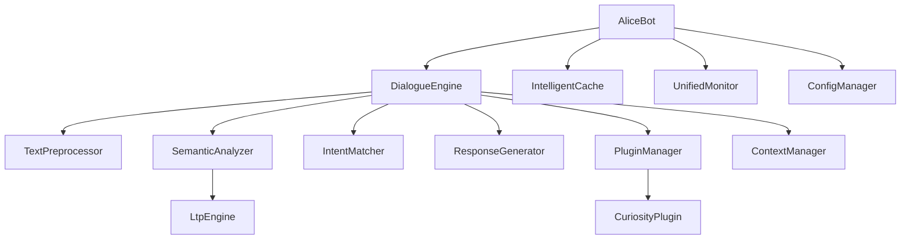

# Alice 项目模块文档

## 📚 概述

Alice 是一个基于 ELIZA 原理的轻量化中文聊天机器人，采用模块化架构设计，支持插件化扩展和轻量级 NLP 处理。

## 🏗️ 架构概览

```
alice/
├── core/                    # 核心引擎模块
├── processors/              # 处理器模块
├── plugins/                 # 插件系统
├── managers/                # 管理器模块
├── cache/                   # 缓存模块
├── scripts/                 # 脚本引擎
├── nlp/                     # NLP 处理模块
├── utils/                   # 工具模块
└── alice_v2.py             # 主入口类
```

## 📦 核心模块详解

### 1. alice_v2.py - 主入口模块

这是重构后的 Alice 机器人主类，提供了统一的对外接口。

#### AliceBot 类

```python
class AliceBot:
    def __init__(
        self,
        script_file: Optional[str] = None,
        rules_file: Optional[str] = None,
        enable_logging: bool = True,
        enable_plugins: bool = True,
        cache_size: int = 100,
        use_ltp: bool = False,
    ):
        """
        初始化 Alice 机器人
        
        Args:
            script_file: 脚本文件路径
            rules_file: 反射规则文件路径
            enable_logging: 是否启用日志
            enable_plugins: 是否启用插件系统
            cache_size: 缓存大小
            use_ltp: 是否使用 LTP 增强
        """
```

#### 主要方法

```python
# 生成响应
def respond(self, user_input: str) -> str:

# 获取对话摘要
def get_conversation_summary(self) -> Dict[str, Any]:

# 获取统计信息
def get_stats(self) -> Dict[str, Any]:

# 重置对话
def reset(self) -> None:

# 清理资源
def cleanup(self) -> None:
```

#### 使用示例

```python
from alice.alice_v2 import AliceBot

# 基本使用
bot = AliceBot()
response = bot.respond("你好")

# 启用插件系统
bot_with_plugins = AliceBot(enable_plugins=True)

# 启用 LTP 增强
bot_with_ltp = AliceBot(use_ltp=True)

# 获取统计信息
stats = bot.get_stats()
print(stats)
```

### 2. core/ - 核心引擎模块

#### 2.1 dialogue_engine.py - 对话主引擎

负责对话流程的整体控制和组件协调。

```python
class DialogueEngine:
    def __init__(
        self,
        script_file: Optional[str] = None,
        rules_file: Optional[str] = None,
        enable_plugins: bool = True,
        use_ltp: bool = False,
    ):
```

**核心功能：**
- 对话流程控制
- 组件协调调度
- 插件管理
- 上下文管理

**对话流程：**
1. 文本预处理
2. 语义分析
3. 意图匹配
4. 插件处理
5. 响应生成
6. 上下文更新

#### 2.2 intent_matcher.py - 意图匹配器

负责用户意图的识别和分类。

```python
class IntentMatcher:
    def match_intent(self, text: str, semantic_info: Dict) -> str:
        """匹配用户意图"""
```

**支持的意图类型：**
- `narrative`: 叙事类
- `emotion`: 情感表达
- `person`: 人物提及
- `relationship`: 关系讨论
- `question`: 疑问句
- `belief`: 观点表达
- `desire`: 愿望表达
- `general`: 通用对话

#### 2.3 response_generator.py - 响应生成器

根据意图和上下文生成合适的响应。

```python
class ResponseGenerator:
    def generate(
        self,
        user_input: str,
        semantic_info: Dict,
        intent: str,
    ) -> str:
        """生成响应"""
```

### 3. processors/ - 处理器模块

#### 3.1 text_processor.py - 文本预处理器

负责文本的标准化和分词处理。

```python
class TextPreprocessor:
    def standardize_text(self, text: str) -> str:
        """标准化文本"""
        
    def segment_text(self, text: str) -> List[str]:
        """分词处理"""
```

**功能特性：**
- 中英文混合处理
- 标点符号标准化
- 特殊字符过滤
- 基于 jieba 的中文分词

#### 3.2 semantic_analyzer.py - 语义分析器

轻量级的语义分析模块，支持可选的 LTP 增强。

```python
class SemanticAnalyzer:
    def __init__(
        self,
        use_ltp: bool = False,
        ltp_engine: Optional[Any] = None,
    ):
    
    def analyze(self, text: str) -> Dict:
        """分析文本语义"""
```

**分析维度：**
- 情感分析（基于词典）
- 意图检测（基于关键词）
- 实体提取（基于规则）
- 话题识别

**LTP 增强模式：**
```python
# 启用 LTP 增强
analyzer = SemanticAnalyzer(use_ltp=True, ltp_engine=ltp_engine)
result = analyzer.analyze("我觉得今天很开心")
```

### 4. plugins/ - 插件系统

#### 4.1 base_plugin.py - 插件基类

定义所有插件必须实现的标准接口。

```python
class BasePlugin(ABC):
    @abstractmethod
    def initialize(self) -> bool:
        """初始化插件资源"""
        
    @abstractmethod
    def process_input(self, text: str, context: Dict[str, Any]) -> PluginResult:
        """处理用户输入"""
        
    def generate_response(self, result: PluginResult) -> Optional[str]:
        """生成响应"""
        
    def cleanup(self) -> None:
        """清理资源"""
```

#### 4.2 plugin_manager.py - 插件管理器

负责插件的注册、初始化和生命周期管理。

```python
class PluginManager:
    def register_plugin(
        self,
        name: str,
        plugin_class: Type[BasePlugin],
        config: Optional[Dict] = None,
    ) -> bool:
        """注册插件"""
        
    def initialize_all(self) -> bool:
        """初始化所有插件"""
        
    def process_input(self, text: str, context: Dict) -> List[PluginResult]:
        """批量处理输入"""
```

#### 4.3 curiosity_plugin.py - 好奇心插件

核心业务逻辑插件，实现好奇心驱动的对话策略。

```python
class CuriosityPlugin(BasePlugin):
    def process_input(self, text: str, context: Dict[str, Any]) -> PluginResult:
        """基于好奇心策略处理输入"""
```

**五大对话策略：**
1. **叙事助推** (P50) - 引导用户继续叙述
2. **实体深度挖掘** (P70) - 深入探讨提及的人物/事物
3. **情感镜像与验证** (P85-90) - 反射用户情感
4. **认知探索** (P55-60) - 引导思考观点
5. **Meta 对话** (P70-95) - 处理关于 Alice 的讨论

### 5. managers/ - 管理器模块

#### 5.1 config_manager.py - 配置管理器

统一的配置管理接口。

```python
class ConfigManager:
    def get(self, key: str, default: Any = None) -> Any:
        """获取配置值"""
        
    def set(self, key: str, value: Any) -> None:
        """设置配置值"""
        
    def load_from_file(self, filepath: str) -> None:
        """从文件加载配置"""
```

#### 5.2 context_manager.py - 上下文管理器

管理对话历史和上下文信息。

```python
class ContextManager:
    def update(
        self,
        user_input: str,
        bot_response: str,
        entities: List[tuple],
        sentiment: float,
        intent: str,
    ):
        """更新上下文"""
        
    def get_recent_turns(self, count: int) -> List[Dict]:
        """获取最近对话轮次"""
        
    def get_context_summary(self) -> Dict[str, Any]:
        """获取上下文摘要"""
```

### 6. cache/ - 缓存模块

#### 6.1 intelligent_cache.py - 智能缓存

基于 LRU 策略的智能缓存实现。

```python
class IntelligentCache:
    def __init__(self, max_size: int = 100):
        """初始化缓存"""
        
    def get(self, key: str) -> Optional[Any]:
        """获取缓存值"""
        
    def set(self, key: str, value: Any, ttl: Optional[int] = None):
        """设置缓存值"""
        
    def get_stats(self) -> Dict[str, Any]:
        """获取缓存统计"""
```

**特性：**
- LRU 淘汰策略
- TTL 过期机制
- 缓存命中率统计
- 自动清理机制

### 7. scripts/ - 脚本引擎

#### 7.1 yaml_script_engine.py - YAML 脚本引擎

支持 YAML 格式的脚本配置和执行。

```python
class YAMLScriptEngine:
    def match(self, text: str, context: Dict) -> Optional[IntentMatch]:
        """匹配意图"""
        
    def generate_response(self, intent_match: IntentMatch) -> str:
        """生成响应"""
```

**YAML 脚本格式示例：**
```yaml
- intent: person_interest
  priority: 70
  condition:
    entities: ["PERSON"]
  templates:
    - "你提到的这个{PERSON}，ta平时是个怎样的人呀？"
    - "听起来你对{PERSON}挺关注的，能多跟我说说ta吗？"

- intent: emotion_validation
  priority: 85
  condition:
    sentiment_range: [-1.0, -0.3]
  templates:
    - "听起来你现在心情不太好呢，能跟我说说是什么让你有这样的感受吗？"
    - "这种感受一定很难受吧？你希望得到什么样的帮助呢？"
```

### 8. nlp/ - NLP 处理模块

#### 8.1 ltp_engine.py - LTP 引擎

LTP 依存句法分析引擎封装。

```python
class LtpEngine:
    def __init__(self, lazy_load: bool = True):
        """初始化 LTP 引擎"""
        
    def analyze(self, text: str) -> LtpAnalysisResult:
        """分析文本"""
        
    @property
    def is_available(self) -> bool:
        """检查引擎是否可用"""
```

**按需加载机制：**
```python
# 延迟初始化，避免启动时加载
engine = LtpEngine(lazy_load=True)

# 实际使用时才加载模型
if some_condition:
    result = engine.analyze(text)
```

### 9. utils/ - 工具模块

#### 9.1 monitor.py - 监控工具

统一的性能监控和日志系统。

```python
class UnifiedMonitor:
    def record_interaction(
        self,
        request_time: float,
        response_time: float,
        success: bool,
        metadata: Optional[Dict] = None,
    ):
        """记录交互数据"""
        
    def log_error(self, operation: str, error: Exception, context: Dict):
        """记录错误信息"""
        
    def get_stats(self) -> Dict[str, Any]:
        """获取监控统计"""
```

#### 9.2 logger.py - 日志工具

结构化的对话日志记录。

```python
class DialogueLogger:
    def log_dialogue(self, user_input: str, bot_response: str):
        """记录对话轮次"""
        
    def log_performance(self, operation: str, duration_ms: float, success: bool = True):
        """记录性能数据"""
```

## 🔄 模块交互关系



## 📊 性能优化策略

### 1. 智能缓存
- LRU 策略避免重复计算
- TTL 机制确保数据新鲜度
- 缓存命中率监控

### 2. 按需加载
- LTP 模型延迟初始化
- 插件系统热插拔
- 资源使用最小化

### 3. 轻量化处理
- 基于规则的快速分析
- 可选的重型模型增强
- 优雅降级机制

## 🔧 配置管理

### 环境变量配置
```python
# 启用 LTP
export ALICE_USE_LTP=true

# 设置缓存大小
export ALICE_CACHE_SIZE=200

# 日志级别
export ALICE_LOG_LEVEL=INFO
```

### 配置文件示例
```json
{
  "plugin": {
    "curiosity": {
      "priority": 50,
      "enabled": true
    }
  },
  "cache": {
    "max_size": 100,
    "ttl": 3600
  },
  "nlp": {
    "use_ltp": false,
    "min_complexity": 10
  }
}
```

## 🧪 测试框架

### 单元测试
```python
# 运行所有测试
pytest tests/

# 运行特定模块测试
pytest tests/test_refactored_modules.py::test_dialogue_engine
```

### 性能测试
```python
# 基准测试
python -m pytest tests/ --benchmark-only
```

## 📈 监控指标

### 核心指标
- 响应时间 (Response Time)
- 缓存命中率 (Cache Hit Rate)
- 插件成功率 (Plugin Success Rate)
- 错误率 (Error Rate)

### 性能基准
| 功能 | 响应时间 | 内存占用 |
|------|----------|----------|
| 基础响应 | <50ms | ~50MB |
| LTP 增强 | <200ms | ~200MB |
| 插件处理 | <100ms | ~80MB |

## 🚀 部署建议

### 生产环境配置
```python
# 生产环境推荐配置
config = {
    "cache": {
        "max_size": 1000,
        "ttl": 1800
    },
    "logging": {
        "level": "WARNING",
        "file": "/var/log/alice.log"
    },
    "monitoring": {
        "enabled": True,
        "sample_rate": 0.1
    }
}
```

### Docker 部署
```dockerfile
FROM python:3.9-slim

COPY requirements.txt .
RUN pip install -r requirements.txt

COPY alice/ /app/alice/
WORKDIR /app

CMD ["python", "-c", "from alice.alice_v2 import AliceBot; bot = AliceBot(); print('Alice ready')"]
```

## 📚 最佳实践

### 1. 插件开发
```python
class MyCustomPlugin(BasePlugin):
    def initialize(self) -> bool:
        # 初始化资源
        return True
    
    def process_input(self, text: str, context: Dict) -> PluginResult:
        # 实现业务逻辑
        return PluginResult(success=True, response="custom response")
```

### 2. 配置管理
```python
# 使用配置管理器
config = ConfigManager()
config.load_from_file("config.json")

# 动态更新配置
config.set("plugin.my_plugin.enabled", False)
```

### 3. 错误处理
```python
try:
    response = bot.respond(user_input)
except Exception as e:
    logger.error(f"对话处理失败: {e}")
    # 优雅降级
    response = "抱歉，我现在有点困惑，能换个话题吗？"
```

## 🔜 未来发展方向

### 短期规划 (1-3 个月)
- 完善 YAML 脚本生态系统
- 增加更多插件类型
- 优化性能基准测试

### 中期规划 (3-6 个月)
- 实现 Web 管理界面
- 支持分布式部署
- 集成机器学习模型

### 长期规划 (6-12 个月)
- 多语言支持
- 个性化对话模型
- 情感计算增强

---
**文档版本**: v2.0  
**最后更新**: 2026年2月19日  
**适用版本**: Alice v2.0+