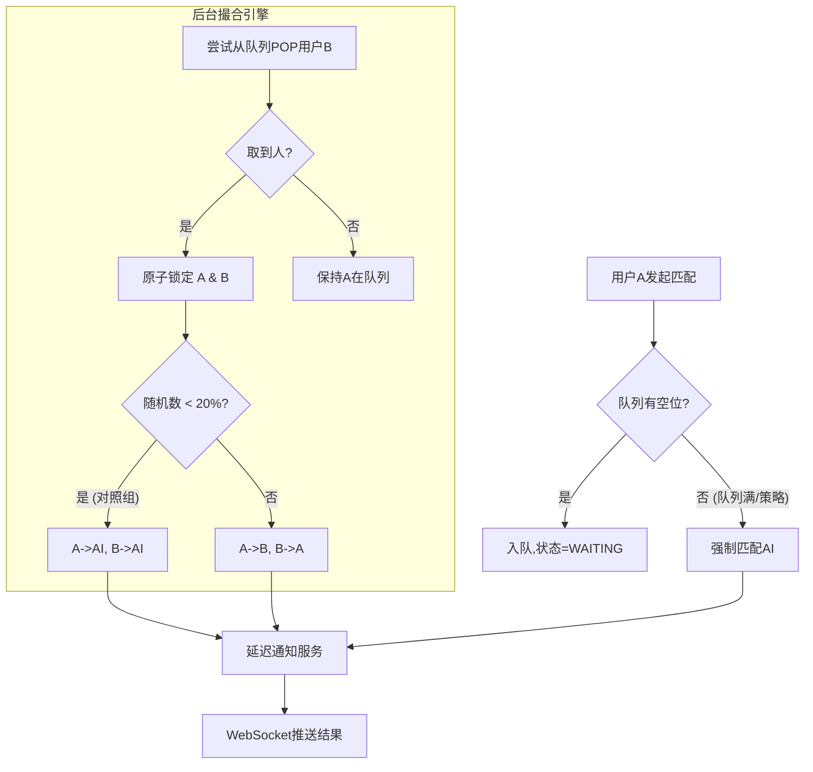

# 匹配机制设计

## 概述

匹配机制是实验平台的核心组件之一，负责将用户与合适的对手（真人或 AI）进行匹配，确保实验的公平性和研究价值。

## 设计目标

### 核心目标

1. **消除时间线索**：确保匹配时间不能作为身份判断的线索
2. **用户体验**：提供良好的匹配体验，避免过长的等待时间
3. **研究纯净性**：确保匹配机制不影响用户判断行为

## 核心原则
核心思路是：将“匹配逻辑的处理时间”与“用户感知的等待时间”解耦。
不再让用户“睡一会再看有没有人”，而是“先看有没有人，再决定什么时候告诉用户结果”。

### 匹配事务的原子性设计
为了防止“真人对局”被单方面中止导致另一方用户被挂起，匹配机制采用原子结算策略：

1. 锁定原则：当检测到两个真人用户时，系统将这对用户视为一个“事务”。在结算完成前，双方均被移出公共队列，处于“锁定状态”。
2. 对称结算（20% 对照组逻辑）：当 20% 概率触发“实验对照组”时，不仅发起者会匹配到 AI，被锁定的等待者也会同时匹配到 AI。
3. 理由：这确保了两位用户拥有相同的匹配等待时间，消除了因“被跳过”而产生的异常长等待。同时，这也保持了时间分布的一致性，防止用户通过“对方消失了但我还在等”来推测匹配机制。
4. 异常处理：如果匹配过程中一方断线，另一方将立即触发“匹配失败”逻辑，并自动重新加入队列或匹配 AI，避免死锁。

### 后台撮合 + 延迟通知

1. 后台即时撮合：用户进入队列后，系统后台立即（实时）检查是否有真人。
2. 如果有真人，立即锁定双方（原子事务）。
3. 如果没有真人，保持等待状态。

# 匹配机制核心实现方案
最稳妥、易于实现的“Redis队列 + 原子锁 + 延时任务”架构。

## 1. 核心数据结构设计

为了支撑“后台撮合”与“原子结算”，我们需要在 Redis 中维护以下关键数据结构：

### 1.1 等待队列
*   **结构**：Redis List (`turing:matching:queue`)
*   **内容**：JSON 字符串，包含 `userId`、`entryTime`（入队时间戳）、`connectionId`（WebSocket连接ID）。
*   **作用**：存储所有正在等待匹配的真人用户，FIFO（先进先出）原则。

### 1.2 用户状态锁
*   **结构**：Redis Key-Value (`turing:user:status:{userId}`)
*   **值**：枚举值 (`IDLE` / `WAITING` / `LOCKED` / `MATCHED`)
*   **TTL**：设置较短过期时间（如 60秒），防止死锁。
*   **作用**：防止用户重复入队，标识用户当前所处的匹配阶段。

### 1.3 匹配事务锁
*   **结构**：Redis Key-Value (`turing:match:tx:{transactionId}`)
*   **作用**：在结算阶段，用于标记两个用户已被“绑定”，防止并发操作导致一方被重复匹配。

---

## 2. 核心流程实现

### 2.1 入队与即时撮合

当用户点击“开始匹配”时，系统不直接让前端等待，而是执行以下逻辑：

1.  **前置检查**：查询 `user:status:{userId}`。
    *   若状态非 `IDLE`，拒绝请求（防止重复匹配）。
2.  **尝试撮合**：
    *   执行 `RPOP turing:matching:queue` 尝试取出一个等待者。
    *   **情况 A：队列为空（无人等待）**
        *   将当前用户 `LPUSH` 入队尾。
        *   设置 `user:status` 为 `WAITING`。
        *   返回前端响应：`{ status: "WAITING", message: "已加入队列" }`。
    *   **情况 B：成功取出对手（有真人等待）**
        *   **进入“原子结算”流程（见 2.2）。**

### 2.2 原子结算与对称性处理 (The Core Logic)

这是实现“消除时间线索”和“防死锁”的关键。当撮合逻辑检测到两个真人（用户A为发起者，用户B为等待者）时：

1.  **加锁与状态流转**：
    *   生成事务ID：`tx_id = UUID()`。
    *   原子操作：将 A 和 B 的 `user:status` 均置为 `LOCKED`。若其中一方状态已被修改（如断线），则抛出异常，另一方回滚或重新入队。
2.  **概率判定（对照组逻辑）**：
    *   生成随机数 `R (0-100)`。
    *   **若 R < 20 (触发对照组)**：
        *   **发起者 A**：分配 AI 对手。
        *   **等待者 B**：**强制分配 AI 对手**（这就是文档中的“对称结算”）。
        *   *理由*：B 虽然在等真人，但为了保证 A 匹配到 AI 时的时间分布一致性，B 必须牺牲本次真人对局机会，以此掩盖“A 其实没匹配到人”的信息。
    *   **若 R >= 20 (正常匹配)**：
        *   **发起者 A**：分配 真人B。
        *   **等待者 B**：分配 真人A。
3.  **结果计算与延时存储**：
    *   计算结果（对手ID、对手类型、房间号）。
    *   **不立即推送**。将结果写入 Redis 缓存：`turing:result:{userId}`，并设置一个过期时间。

### 2.3 延迟通知机制

为了消除“匹配快慢”作为判断线索，我们将结果通知与撮合过程解耦。

*   **实现方式**：后台定时任务（Cron 或 Delay Queue）或 简单的“等待前端轮询”。
*   **务实方案（推荐）：前端轮询 + 服务端Hold**
    *   前端发起匹配请求后，进入 Loading 状态。
    *   服务端在撮合完成后，不立即返回，而是让线程 `sleep(随机时间 2s-5s)`，或者先返回“排队中”，由前端在 2-5 秒后发起第二次“查询结果”请求。
    *   **更好的实现（纯异步）**：
        *   撮合完成后，系统计算 `notify_time = now() + random_offset`。
        *   定时扫描器扫描 `notify_time` 已到的结果，通过 WebSocket 推送给前端。
    *   **时间混淆策略**：
        *   匹配到真人：为了掩盖“瞬间匹配”的事实，强制增加 2-4 秒延迟。
        *   匹配到 AI：通常是因为队列无人，本身就消耗了等待时间，可能不增加延迟或增加较少。
        *   *最终效果*：用户感知的等待时间总是稳定在一个区间（如 3-6 秒），无法通过“太快”或“太慢”来推断对手是 AI 还是真人。

---

## 3. 异常处理与边界情况

### 3.1 掉线处理 (防死锁)
*   **场景**：用户 A 和 B 刚进入原子结算阶段，A 突然断网/关闭页面。
*   **处理**：
    *   服务端监听 WebSocket 断开事件。
    *   检查断开用户的 `user:status`。
    *   若为 `WAITING`：从队列中移除。
    *   若为 `LOCKED`：此时事务正在进行中。通过 Redis Pub/Sub 通知匹配服务“用户断开”，匹配服务捕获异常，将另一方（B）的状态重置，并触发“重新匹配 AI”逻辑（作为补偿，B 此时不再进入公共队列，直接匹配 AI 以结束流程）。

### 3.2 队列超时
*   **场景**：用户排队太久，无人匹配。
*   **处理**：
    *   设置队列最大等待时间（如 60秒）。
    *   后台任务扫描队列首部元素，若 `now() - entryTime > 60s`：
        *   移出队列。
        *   分配 AI 对手。
        *   走正常的“延迟通知”流程。
    *   *注意*：此时用户等待时间较长，通知时不应再增加额外延迟，直接推送结果。

---

## 4. 总结：核心实现流程图解

