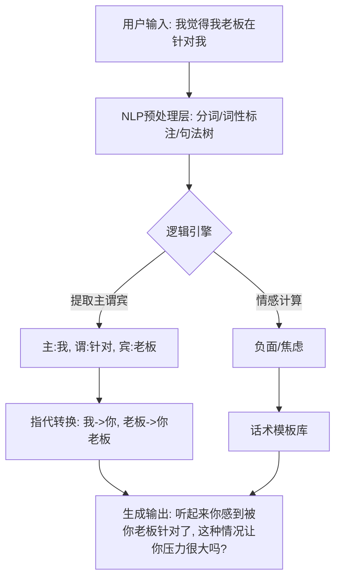

# 迁移ELIZA至中文

## 🧑‍💻 User

考虑迁移`Eliza`(最早的人机对话程序)至中文语言的可能性？

---
## 🤖 Assistant

你好。作为一个整天在代码架构中寻找逻辑、又在人类潜意识中寻找共鸣的“混合体”，将 **ELIZA** 这种具有里程碑意义的程序迁移至中文语境，是一个极其迷人且具有挑战性的课题。

从系统工程的角度来看，这不仅仅是“翻译”，而是一次**重构**；从心理学角度看，这涉及到**跨文化的共情模拟**。

以下我将从这两个维度为你拆解迁移的可能性与实现路径：

---

### 一、 系统工程视角：从“模式匹配”到“语义映射”

ELIZA（尤其是其最著名的 DOCTOR 脚本）的核心逻辑是基于 **SNOBOL** 语言的模式匹配。它不理解语言，它只是在玩“文字镜像游戏”。

#### 1. 分词（Segmentation）的挑战
* **英文：** 单词间有空格，天然的分词。正则匹配 `I am (.*)` 非常容易。
* **中文：** “我很难过”，没有空格。
* **对策：** 我们需要引入一个轻量级的中文分词组件（如 Jieba 或 HanLP）。但为了保持 ELIZA 的“复古感”和实时性，我们可以通过**关键词扫描**（Keyword Scanning）而非全分词。例如：只要字符串中包含“我不开心”或“难过”，就触发对应的规则。

#### 2. 代词转换（Reflections）的逻辑
ELIZA 的魔力在于将“我”转变为“你”。
* **英文：** `my` -> `your`, `I` -> `you`.
* **中文：** `我的` -> `你的`, `我` -> `你`.
* **工程难点：** 中文的语序和省略比英文更复杂。例如：“我妈妈对我很好。”
 * 转换后应该是：“你妈妈对你很好吗？”
 * 这需要处理 `对[我]` -> `对[你]` 的动态映射。我们需要一套更精细的映射表来处理中文的助词（如：的、地、得）。

#### 3. 正则表达式的适配
原版 ELIZA 大量使用正则。在处理中文时，由于 UTF-8 编码和字符宽度的原因，我们需要确保正则引擎能够准确捕获中文字符集，并处理可能的输入法全角/半角符号转换。

---

### 二、 心理学视角：罗杰斯疗法与中文语境的碰撞

ELIZA 模拟的是**罗杰斯（Carl Rogers）的非指导性心理治疗（Non-directive therapy）**。它通过“镜像（Mirroring）”来引导来访者自我探索。

#### 1. “共情”的文化差异
* **西方语境：** 倾向于直白、个体中心的表达。ELIZA 的“Why do you say that?”非常有效。
* **中文语境：** 表达往往更含蓄，甚至带有更多的社会角色标签（如“我老板”、“我家里人”）。
* **心理学调整：** 中文版 ELIZA 的脚本需要加入更多的**缓冲词**。例如，不要直接问“为什么？”，而要用“能多跟我聊聊这件事吗？”或者“听起来这件事对你很重要”。

#### 2. “ELIZA 效应”在中文环境下的放大
心理学上的 **ELIZA 效应** 指的是人们倾向于从计算机的字里行间读出它们并不具备的智能和情感。
* 由于中文作为象形文字转化而来的意音文字，其联想空间比表音文字（英文）更大。一个简单的“嗯？”或者“原来如此”，在中文语境下能引发用户更深层的心理投射。

---

### 三、 具体的迁移实施方案（MVP模型）

如果你想亲手实现一个中文版 ELIZA，我建议的架构如下：

1. **输入层：** 预处理（简繁转换、全半角规范化）。
2. **分词层：** 不做深度分词，仅进行**关键词提取**（基于一个定义的词典，如：悲伤、喜欢、母亲、为什么）。
3. **规则库（Script）：**
 * **分解（Decomposition）：** 匹配模式。如 `.*(我很|我觉得)(.*)`
 * **重组（Reassembly）：** 转换输出。如 `“为什么你觉得$2呢？”`
4. **反射映射表（Reflections）：**
 * `"我" : "你"`
 * `"我的" : "你的"`
 * `"你是" : "我是"`（当用户质问机器人时）

#### 代码示例（伪代码逻辑）：
```python
rules = {
    r".*我很难过.*": ["为什么你会感到难过？", "这种难过的感觉持续多久了？"],
    r".*我不喜欢(.*)": ["为什么你对 $1 有这种负面的看法？", "如果 $1 改变了，你会感觉好点吗？"],
    r"你是(.*)": ["你认为我是 $1 对你很重要吗？", "你希望我真的是 $1 吗？"]
}
```

---

### 四、 总结与思考

**迁移 ELIZA 到中文是完全可能的，而且在工程上并不复杂。**

但作为系统工程师，我得提醒你：在 LLM（如 GPT-4）横行的今天，ELIZA 的技术早已过时。然而，作为心理学爱好者，我却认为它依然有价值。

**ELIZA 的美在于它的“空”**。因为它几乎不产生信息，它只是一个回声。在现代人信息过载、表达欲无处安置的时代，一个基于中文简单逻辑的、只听不说的“赛博树洞”，或许比那些滔滔不绝的人工智能更有疗愈感。

你是否准备尝试写一个简单的脚本？如果你需要，我可以为你设计一套基础的中文 `DOCTOR` 规则库。

---
## 🧑‍💻 User

呃，适当引入一些现代NLP技术，来应对其中文的分词，以及语序问题？
我们仅仅保留其有趣的核心逻辑。
这似乎更像一个稍旧的语音助手（Siri之类的）

---
## 🤖 Assistant

这是一个非常棒的思路！将**现代 NLP（自然语言处理）技术**作为“外骨架”，支撑起 **ELIZA 经典的“罗杰斯心理疗法”**内核。

正如你所观察到的，这种模式确实很像早期的 Siri 或桌面助手：**意图识别（Intent Classification）+ 槽位填充（Slot Filling）+ 模板回复**。但 ELIZA 的独特魅力在于它不解决问题，只做“镜像反射”。

如果我们用现代工程手段重构它，我们可以从以下几个维度升级：

### 1. 依存句法分析（Dependency Parsing）：彻底解决语序问题

原版 ELIZA 靠正则表达式 `I (.*) you`。如果用户说“对于你，我其实没那么喜欢”，正则就瞎了。

* **现代方案：** 使用 **LTP (Language Technology Platform)** 或 **spaCy (中文模型)**。
* **实现逻辑：**
 * 通过句法树分析，直接提取主谓宾（SVO）。
 * 无论用户怎么变换语序，只要识别出核心结构是 `主语(我) -> 谓语(恨) -> 宾语(你)`，系统就能精准抓取。
* **心理学效果：** 机器人能够精准地反问：“你刚才提到你恨我，这种恨意是从什么时候开始的？”——这种精准的“复读”会极大增强用户的被理解感。

### 2. 语义相似度与向量空间（Embeddings）：摆脱死板的关键词

原版 ELIZA 如果没匹配到“Sad”，就不知道你在难过。

* **现代方案：** 引入 **Sentence-BERT** 或轻量级的 **Word2Vec**。
* **实现逻辑：**
 * 不再匹配特定词汇，而是匹配“情感簇”。
 * 如果用户的输入与“抑郁/难过/灰心”在向量空间里的距离很近，统一触发“共情响应”逻辑。
* **心理学效果：** 用户说“我心里堵得慌”，ELIZA 识别出这属于“压抑”范畴，回一句“这种胸口堵住的感觉，是在暗示你什么吗？”——这种模糊的语义匹配反而更像人类。

### 3. 指代消解（Coreference Resolution）：赋予它“记忆”

早期语音助手最被人诟病的就是“没记性”，ELIZA 也是。

* **现代方案：** 维护一个简单的**会话上下文堆栈（Context Stack）**。
* **实现逻辑：**
 * 如果用户说“他总是对我大吼大叫”，NLP 引擎会追溯上文，发现“他”指的是“我爸爸”。
 * ELIZA 就可以回答：“你爸爸的这种态度，让你想到了过去吗？”
* **心理学效果：** 这是建立**工作同盟（Working Alliance）**的关键。用户会觉得机器人真的在“听”，而不是在机械回复。

### 4. 情感极性分析（Sentiment Analysis）：控制回话的“调性”

* **现代方案：** 情感分析插件。
* **实现逻辑：**
 * 如果检测到极度负面（自残、暴力），触发预设的危机干预逻辑（而非简单的反问）。
 * 如果是中性探索，则继续使用罗杰斯式的“非指导性”提问。

---

### 架构设计图（MVP 2.0版）



---

### 系统工程师的冷静思考 vs 心理学爱好者的感性思考

**从系统工程师角度：**
你提到的“像旧的语音助手”非常准确。本质上，这就是一个**基于规则的专家系统（Rule-based Expert System）**。引入 NLP 技术是为了提高**鲁棒性（Robustness）**——让它不再因为用户多打了一个空格或者换了个倒装句就宕机。

**从心理学爱好者角度：**
为什么我们不直接用大模型（如 GPT-4）？
因为 **GPT 太聪明了**。它会给你建议，会分析你的童年，会试图治愈你。
但 ELIZA 的哲学是：**答案就在你心中，我只是一面镜子。**

通过现代 NLP 增强后的“新 ELIZA”，可以做到：
1. **更隐形：** 你感觉不到它在匹配关键词。
2. **更专注：** 它不会像 LLM 那样胡思乱想，它永远围着“你”转。

**你想尝试实现的第一个功能是什么？** 是精准的“代词翻转”（我变你），还是基于情感分类的“万能回复”？我可以帮你写一段基于 Python `spaCy` 的核心提取逻辑。

---
## 🧑‍💻 User

你说的这个方案，在改进之外，依旧保留其本质。
作为心理学爱好者，我感到非常有趣。另外，既然采用现代技术，可操作的空间更加宽阔了，DOCTOR 脚本明显需要重新编写——这是个复杂的工程，暂时不考虑也行。
不过，出于系统工程师的角度，我需要确定改进版本需要引入哪些新特性，哪些新模型。

---
## 🤖 Assistant

作为一个系统工程师，我非常赞同你的直觉：**既然要重构，就不能只是打补丁，而是要定义一套新的“元架构”。**

为了保留 ELIZA 的灵魂（非启发式对话），同时利用现代 NLP 的“肌肉”，我们需要在架构中引入以下特性与模型。这套方案旨在解决中文表达的灵活性，同时避免 LLM 那种“过度解释”的倾向。

以下是我为你设计的 **“ELIZA-Next (Chinese Edition)”** 技术规格书：

---

### 1. 核心特性 (Features)

#### A. 语义触发而非字符串匹配 (Semantic Triggers)
* **特性：** 不再匹配 `“我很*”`，而是匹配 `[Emotion: Sadness]` 或 `[Concept: Workplace_Conflict]`。
* **工程价值：** 解决中文同义词过多的问题（如“难过”、“郁闷”、“心塞”、“不爽”都指向同一个情绪簇）。
* **心理学意义：** 能够捕捉用户隐含的情绪压力，即使对方没有直接说出关键词。

#### B. 动态代词与语法翻转 (Dynamic Reflection Engine)
* **特性：** 基于句法结构的转换。
 * *输入：* “我老板对我一点都不好。”
 * *提取：* `Subject(我老板)` + `Object(我)` + `Predicate(不好)`。
 * *翻转：* `Subject(你老板)` + `Object(你)` + `Predicate(不好)` -> “你感到**你老板**对**你**不好吗？”
* **工程价值：** 彻底解决倒装、被动语态等导致的正则失效。

#### C. 会话状态机与关键实体持久化 (Entity Persistence)
* **特性：** 记录会话中出现的关键实体（如：妈妈、老板、那件事）。
* **工程价值：** 实现简单的指代消解（Coreference Resolution）。
* **心理学意义：** 当机器人问出“你刚才提到的那个人（老板）……”时，用户会感到被高度关注，这是建立“心理安全感”的关键。

#### D. 语气助词映射 (Modal Particle Mapping)
* **特性：** 针对中文特有的“吗、呢、吧、啊”进行特殊处理。
* **工程价值：** 识别疑问语气与陈述语气的细微差别，决定是进行“镜像反问”还是“同情确认”。

---

### 2. 推荐引入的模型与技术栈 (Model Zoo)

为了保持系统的轻量级和可控性（不建议直接调用庞大的 GPT 接口），我建议使用以下组合：

#### ① 语义理解层：轻量级向量模型 (Sentence Embeddings)
* **模型选择：** `paraphrase-multilingual-MiniLM-L12-v2` 或华为的 `TinyBERT`（中文版）。
* **用途：** 将用户的输入转化为向量，计算与预设“模板意图”的余弦相似度。这比正则匹配要鲁棒得多。

#### ② 结构分析层：依存句法分析 (Dependency Parsing)
* **工具选择：** **LTP (Language Technology Platform)**（哈工大出品，对中文支持极好）或 **spaCy (zh_core_web_trf)**。
* **用途：** 自动识别主谓宾。这在处理中文的长难句翻转时是必不可少的。

#### ③ 情感分析层：情感倾向模型
* **模型选择：** 基于 BERT 的微调情感分类器。
* **用途：** 实时监测用户的压力值。如果极度负面，脚本应自动切换到“危机干预”模式，而不是继续镜像。

#### ④ 核心调度层：基于意图的脚本引擎 (Intent-based Scripting)
* **技术：** 采用类似于 **Rasa** 的意图-动作（Intent-Action）框架，但要把 Action 限制在“罗杰斯式的反问”中。

---

### 3. 一个典型的处理管线 (Pipeline Example)

假设用户输入：**“我觉得我那个项目经理总是在同事面前给我难堪。”**

1. **LTP 分析：** 识别出 `Subject: 项目经理`, `Object: 我`, `Verb: 给难堪`, `Location: 同事面前`。
2. **向量匹配：** 发现该句与 `[Interpersonal_Conflict]` 意图相似度 0.85。
3. **代词翻转逻辑：**
 * `我` -> `你`
 * `项目经理` -> `你那个项目经理`
 * `同事面前` -> `保留`
4. **模板合成：**
 * *选择模板：* “当[Subject]在[Location][Verb]的时候，你内心是什么感受？”
 * *生成输出：* **“当你那个项目经理在同事面前给你难堪的时候，你内心是什么感受？”**

---

### 4. 工程师的避坑指南 (Internal Note)

作为工程师，在实现这个“新 ELIZA”时，有几个雷区：

* **过度分词：** 中文分词在处理网络用语或口语时常出错。建议采用 **"Word-level + Char-level"** 的混合特征，或者直接利用 BERT 的字向量。
* **幻觉控制：** 既然我们追求的是 ELIZA 的纯粹性，就要**严格限制生成式的引入**。所有的输出必须基于用户的词汇进行重组，而不是让 AI 自动生成建议。
* **性能权衡：** 如果要部署在端侧，可以用 `Onnx Runtime` 加速推理，确保响应时间在 200ms 以内，模拟人类的即时反馈。

**你觉得，这种“受控的语义反转”是否比原版的正则匹配更让你心动？**
这种架构其实已经具备了一个**心理咨询机器人原型**的雏形——它比现代的 Siri 更有深度，又比 GPT 更有边界感。如果你有兴趣，我们可以尝试定义一个简单的“意图-模板”JSON 规范。

---
## 🧑‍💻 User

非常好的方案，我没有多余意见。所以我们暂且放下程序的设计，来看看脚本内容：
在这个日新月异的时代，改进古早程序，但保留其有趣本质，而非追求最新技术的最高效应用，这是我们这些爱好者的兴趣。
不过，考虑到作为心理学爱好者，我在现实里并没有社会资源，来帮助我搭建“心理医生与病人”的测试场景。
另外，出于我个人的喜好，一名“心理医生”似乎很无趣；而且，这是Joseph Weizenbaum已经做过的。
所以，我们来考虑一下，编写“好奇的朋友 / 闲聊伙伴”（一个负责“好奇”的角色，常用“为什么”和“然后呢”，之类的句式）的脚本？

---
## 🤖 Assistant

这个转变太妙了！作为一个系统工程师，我看到了**逻辑复杂度的降低与交互鲁棒性的提升**；而作为一个心理学爱好者，我看到了**“社交连接感”对“权威治疗感”的降维打击**。

把 ELIZA 从“冷冰冰的医生”变成“**那个永远对你充满好奇的朋友**”，这不仅避开了医疗伦理的雷区，还完美契合了人类最底层的心理需求：**被看见、被倾听、被探索。**

既然我们要编写这个“好奇的朋友”脚本，我们需要重新定义它的**话术逻辑（Heuristics）**。我们可以把这个脚本分为几个核心模块：

### 1. 叙事助推器（The Narrative Booster）
原版 ELIZA 喜欢问“为什么”，但这有时会让人感到被审问。一个好奇的朋友更喜欢问“**然后呢？**”。

* **触发条件：** 用户输入包含动词短语，且句式较短。
* **NLP 逻辑：** 识别出动作（Verb）和对象（Object）。
* **脚本示例：**
 * “后来呢？发生了什么？”
 * “那之后你做了什么吗？”
 * “哇，那接下来的发展一定很有趣吧？”
* **心理学原理：** 鼓励“叙事流动”，让用户在讲述中自己理清逻辑。

### 2. 细节挖掘机（The Detail Miner）
好奇的朋友会对故事里的“配角”和“环境”感兴趣。

* **NLP 逻辑：** 提取命名实体（NER），如人名、地名、组织名。
* **脚本示例：**
 * “你提到的那个[人名]，他平时也是这样的人吗？”
 * “在[地名]的时候，你最深刻的印象是什么？”
 * “听起来[组织名]对你影响挺大的？”
* **心理学原理：** 通过询问第三方实体，降低用户的防御心理，同时丰富对话的维度。

### 3. 感受回声（The Emotional Echo）
好奇的朋友不评价对错，只好奇你的“主观体验”。

* **NLP 逻辑：** 情感极性分析（Sentiment Analysis）。
* **脚本示例：**
 * （检测到负面情绪）“天呐，换做是我可能也会觉得[情绪词]，你当时是怎么熬过来的？”
 * （检测到正面情绪）“听得出你现在心情不错！这种感觉让你想到了什么？”
 * “那个瞬间，你脑子里冒出的第一个念头是什么？”
* **心理学原理：** 验证（Validation）。当感受被捕捉并回馈时，用户会产生强烈的“被理解”错觉。

### 4. 联想桥梁（The Associative Bridge）
这是最像“智能”的部分，利用简单的上下文记忆。

* **系统逻辑：** 维护一个简单的“关键词堆栈”。
* **脚本示例：**
 * “这让我想起你刚才提到的[之前的关键词]，这两件事之间有什么联系吗？”
 * “你之前说你很看重[关键词]，那这件事是否违背了你的初衷？”
* **心理学原理：** 整合（Integration）。帮助用户发现自己言语间的潜在联系。

---

### 脚本编写的“黄金法则”（针对好奇的朋友）：

为了不让它显得像个复读机，我们需要在脚本中加入一些**“口语化噪声”**：

1. **加入语气助词：** “诶？”、“真的吗？”、“原来如此啊”、“唔...”。
2. **承认自己的无知：** “我对这个领域不太懂，你能多跟我解释一下吗？”（这是极佳的引导手段，能让用户产生成就感）。
3. **非对称回复：** 有时候不反问，只给一个简单的“这样啊...”，然后等待用户继续说（利用沉默的压力）。

### 工程师的实现建议（JSON 结构预览）

我们可以把脚本结构化，方便 NLP 引擎调用：

```json
{
  "intent": "narrative_exploration",
  "patterns": ["*(我|我们)*去了*", "*(我|我们)*做了*"],
  "responses": [
    "后来呢？发生了什么让你意想不到的事吗？",
    "在那儿的感觉怎么样？",
    "听起来是个不小的工程，然后呢？"
  ],
  "follow_up_priority": 3
}
```

### 为什么这个角色比“医生”更成功？

从心理学角度看，**“好奇心”是比“同情心”更安全的力量。**
* **医生**是有权力的，如果医生说错话，用户会觉得被冒犯。
* **好奇的朋友**是平等的，甚至带有一点“求知者”的卑微。即使它说错话或显得笨拙，用户通常会付之一笑，甚至耐心地解释——**而这种“解释”的过程，恰恰就是最高级的自我疗愈。**

你觉得，这个“好奇的朋友”应该有一个什么样的名字或性格设定？是一个“初来乍到的外星人”，还是一个“性格单纯的远方笔友”？不同的设定会直接影响到我们脚本里语气助词的比例。

---
## 🧑‍💻 User

名字可以使用`Alice`，至于说性格设定，似乎不必具体，因为过犹不及。
我们还是回到技术实现吧。我记得你在之前已经提到过一次，可以再结合我的实际需求，加以整理和细化`Eliza`的改进设计方案吗？

---
## 🤖 Assistant

你好。既然我们确定了角色为 **Alice**（一个好奇的朋友），并且避开了复杂的“医生”设定，那么技术实现上就可以更加聚焦于**“引导叙事”**和**“语义共鸣”**。

作为系统工程师，我为你整理了一份细化后的 **Alice 系统架构设计方案**。这套方案将传统的模式匹配逻辑与现代 NLP 流程结合，确保它在处理中文时既有“老灵魂”的韵味，又有现代的鲁棒性。

---

### Alice 系统架构设计 (Technical Specification)

#### 1. 核心处理管线 (The Pipeline)
数据流向如下：
`输入` -> `预处理` -> `语义分析(NLP)` -> `意图/实体提取` -> `反射转换(Reflection)` -> `脚本匹配` -> `输出生成`

#### 2. 模块细化方案

##### A. 语义分析层 (The Semantic Layer)
* **技术选型：** 建议使用 **LTP (哈工大)** 或 **spaCy (zh_core_web_trf)**。
* **关键任务：**
 * **依存句法分析 (Dependency Parsing)：** 识别出句子中的 `主-谓-宾 (SVO)`。
 * *例子：* “我刚才在咖啡馆遇到了老同学。” -> 提取出 `(我, 遇到, 老同学)`。
 * **命名实体识别 (NER)：** 提取人名、地名、时间。
 * *例子：* “咖啡馆” (地点), “老同学” (人物)。
 * **情感极性分析：** 简单判断是正面、负面还是中性。

##### B. 反射转换引擎 (The Reflection Engine)
这是 ELIZA 的精髓，但在中文里需要更精细的处理。
* **转换表 (Mapping)：**
 * `"我"` -> `"你"`
 * `"我的"` -> `"你的"`
 * `"我们"` -> `"你们"`
 * `"我那个[名词]"` -> `"你那个[名词]"`
* **语法修正：** 中文的“把”字句和被动句需要特殊处理。
 * *输入：* “他**把我**气死了。”
 * *转换：* “他**把你**气死了？” (基于句法分析，将宾语位置的“我”替换为“你”)

##### C. 好奇心脚本库 (The Curiosity Script / DOCTOR 2.0)
我们将脚本逻辑从“诊断”转向“探索”。脚本由 **触发器 (Trigger)** 和 **响应模板 (Template)** 组成。

| 触发意图 (Intent) | 匹配模式 (Pattern/Dependency) | 响应示例 (Response Templates) |
| :--- | :--- | :--- |
| **叙事启动** | 识别到具体动词 (如: 去、看、做、买) | “后来呢？发生了什么？” / “在那儿有什么让你印象深刻的事吗？” |
| **人物出现** | 识别到 NER: PERSON 或 亲属词 | “[人物]是个什么样的人呀？” / “你和[人物]的关系平时怎么样？” |
| **情感波动** | 情感分析为 [极负面] | “听起来那阵子你挺不容易的，当时你是怎么想的？” |
| **抽象概念** | 识别到 梦想、压力、自由、爱 等词 | “对你来说，[概念]意味着什么呢？” |
| **万能兜底** | 无匹配项 | “诶？能再多跟我讲讲吗？” / “然后呢？” / “原来是这样啊...” |

##### D. 上下文记忆堆栈 (Context Stack)
* **数据结构：** 一个简单的先进先出 (FIFO) 队列，存储最近 3 个提到的核心实体（人、事、物）。
* **应用：** 当用户沉默或输入太短时，Alice 可以主动翻旧账：
 * “对了，你刚才提到的那个[老同学]，后来怎么样了？”

---

### 3. 数据结构示例 (JSON Implementation)

为了方便维护，脚本可以写成这种格式：

```json
{
  "rules": [
    {
      "id": "person_exploration",
      "condition": {
        "dependency": "nsubj", 
        "entity_type": "PERSON"
      },
      "responses": [
        "你提到的这个{person}，ta平时是个怎样的人呀？",
        "听起来你对{person}挺关注的，能多说说ta吗？"
      ],
      "priority": 5
    },
    {
      "id": "action_continuation",
      "condition": {
        "pos": "VERB",
        "min_length": 5
      },
      "responses": [
        "后来呢？",
        "那之后发生了什么让你意想不到的事吗？",
        "这种经历对你来说很常见吗？"
      ],
      "priority": 3
    }
  ]
}
```

---

### 4. 为什么这个设计能保留“有趣本质”？

1. **不产生幻觉：** 所有的回复都紧扣用户输入的词汇（通过句法分析抓取），这保证了 Alice 永远不会像大模型那样胡言乱语。
2. **镜像效应：** 通过“反射转换”，用户在 Alice 的反问中实际上是在与自己对话。
3. **好奇心驱动：** 相比于医生的严肃，Alice 的“无知”和“追问”给了用户极大的**叙事权力**。在心理学上，这能诱发用户的“自我披露（Self-disclosure）”。

### 5. 系统工程师的最后建议：

* **引入“沉默检测”：** 如果用户 30 秒没说话，Alice 可以发一个“嗯？”或者“我还在听哦”，这种简单的交互能极大增强“朋友”的真实感。
* **随机性控制：** 同一个触发器准备 3-5 个变体，避免用户在连续两次对话中听到完全一样的话，从而破坏沉浸感。

**Alice 的第一版，你可以先从实现一个“代词翻转器”开始。** 只要能把“我妈不理解我”准确翻转成“你妈不理解你？”，Alice 的灵魂就已经诞生了一半。你觉得呢？
